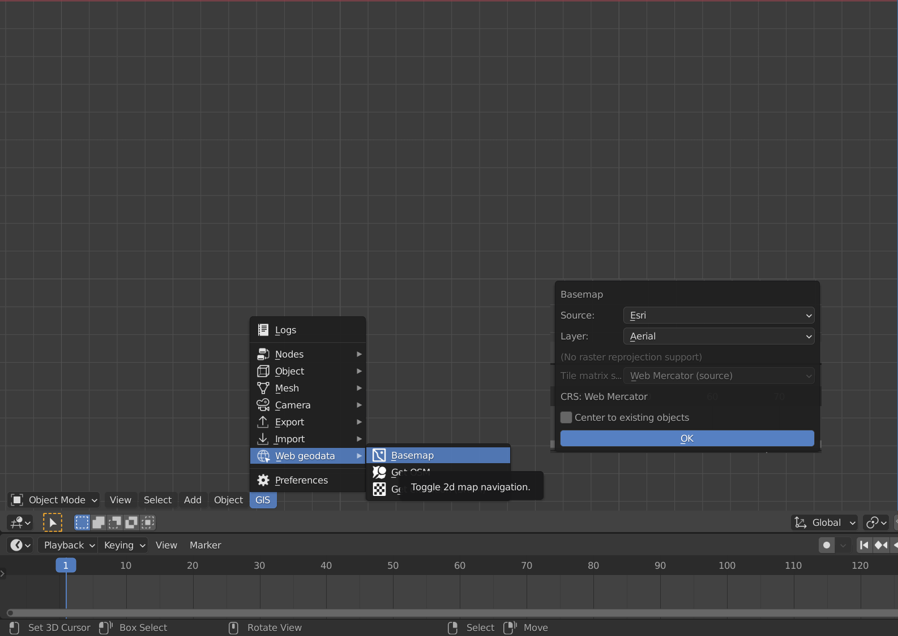

[[Noah Chapman]]
Date: 2021-10-05

# Blender GIS for Archaeological Visualization

[Blender](https://www.blender.org) is a free and open-souce 3D modeling engine. Some familitarity for its use is assumed for this document. 

Blender GIS can be found [here](https://github.com/domlysz/BlenderGIS).  

## ArcMAP Export

In ArcMap I collated the layers I wanted to use. Each layer was saved as a **Shapefile (.shp)** within the Catalog. Further instructions on ArcMap exporting [here](https://pro.arcgis.com/en/pro-app/latest/help/data/geodatabases/overview/export-data.htm)

## Blender GIS Import
First, find a basemap. GIS - Web Geodata - Basemap

Basemaps come from a number of sources and can be customized based on needs and map projections. For full documentation on how to manipulate the map, see [here](https://github.com/domlysz/BlenderGIS/wiki/Quick-start). 

!(BlenderGIS_3.png)

Press G to look up a desired location. This may take a few moments to load. Press E when you are happy with the map. 

!(BlenderGIS_4.png)

GIS - Web Geodata - SRTM to get elevation and topography. This may take a while. You can also try Get OSM for simple buildings, although this didn't work for my data. 

!(BlenderGIS_5.png)

With the Basemap in place we can import shape files. Make sure these are using the same projection as the original ArcMap data. 

!(BlenderGIS_6.png)
With the Layers in place we can now align them to the basemap. This might take some resizing and rotating to get properly aligned. 

!(BlenderGIS_7.png)
I've hidden the other layers, only keeping the street layout. Since it will clip through the basemap, we are going to shrinkwrap this layer to the topography. Set the target to the basemap with an offset of around 0.1m. Apply the modifier. 

!(BlenderGIS_8.png)
Go to edit mode (enter key), select all verticies (A key), and extrude upwards (E key + directional control)

That is as far as the current process goes, but there's a lot of potential and this document will be updated as the project goes on.  
