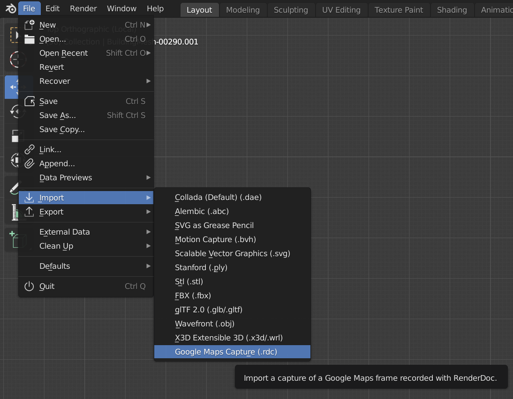

[[Noah Chapman]]
Date: 2021-10-13

# Importing Google Earth 3D Models to Blender

This is the workflow for importing Architectural 3D models from Google Maps into Blender. You will need a couple of addons, [RenderDoc](https://renderdoc.org), and the [Maps Model Importer Addon](https://github.com/eliemichel/MapsModelsImporter) . You will also benefit from viewing this video: https://www.youtube.com/watch?v=F_XsmoZJmG8. 

Some experience with Blender is assumed for this document. 

## Setting Up RenderDoc
Something that is not noted in the linked video is that the "Enable Process Injection" setting needs to be enabled. Tools - Settings - General - Enable Process Injection

## Setting up the Browser
This only works with a Chrominium browser (Chrome, Latest Edge, Vivaldi)

You will need to create a shortcut, using the target: 

C:\Windows\System32\cmd.exe /c "SET RENDERDOC_HOOK_EGL=0 && START "" ^"C:\Program Files (x86)\Google\Chrome\Application\chrome.exe^" --disable-gpu-sandbox --gpu-startup-dialog"

Replace the location of the program with their own. Shown below is mine. I use Vivaldi so it looks a bit different. 

In RenderDox, go File- Inject into Process. Open the browser shortcut, if it works right you should be given a dialogue box with a number. Match the number with the RenderDoc list and choose "Inject". This process is a bit tricky and may cause some issues.  If you've done it right, and FPS readout should appear on your browser. 

Open up Goodle Earth in Browser and search for the site you want to extract. I've zoomed into the theatre district of Pompeii. In RenderDoc, you can press "Capture Frame(s) Immediately" to capture a file. It will take a moment to capture, 

Save the created file to a place you can find it. It will be saved as an .rdc file.

## RenderDoc to Blender
Open up Blender and install the Maps Model Importer addon through Addons - Preferences - Addons -Install. Once that is done you should see an added import option in the import menu. File-Import-Google Maps Data (.rdc). Find your .rdc file and import it. 

This may take a while, but eventually the Google 3D model will appear in Blender. If only part of the model is imported, don't worry! You may have to go back and try capturing again, try a different angle or zoom limit. The closer, the better fidelity. 

The model will probably need a bit of cleanup, but should be nicely organized into easily-edited tiles. 
